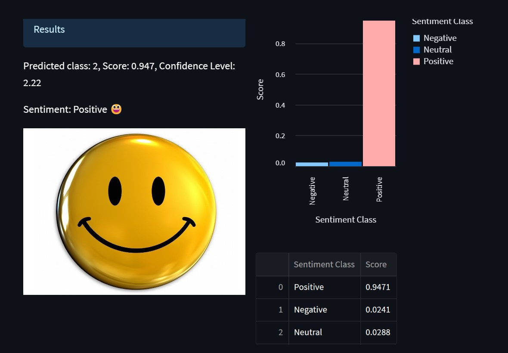

# Streamlit_Covid_vaccine-tweet-analytics-app
Build a streamlit app for the classifcation of tweet using pretrained models from Huggingface. Huggingface provides access to various pre-trained models for sentiment analysis, including BERT, RoBERTa, and DistilBERT, among others.

## Summary
| Code      | Name        | Published Article |  Deployed App |
|-----------|-------------|:-------------:|------:|
| LP5 | Covid_vaccine-tweet-analytics-app with Streamlit |  [https://medium.com/@alidu143/building-a-streamlit-webapp-for-the-analyses-of-sentiment-towards-the-covid-vaccines-from-tweets-c5552cc88e1c](/) | [https://huggingface.co/spaces/Abubakari/Covid_Vaccines_Tweet_Sentiment_Analysis](/) |

## Project Description
The "Covid_vaccine-tweet-analytics-app" is a Streamlit web application that uses pre-trained models from Huggingface to classify the sentiment of tweets related to Covid-19 vaccines. The app allows users to enter a keyword or phrase related to Covid-19 vaccines and displays the sentiment analysis of the resulting tweets in real-time. The models used in the app include BERT, RoBERTa, and DistilBERT, which are state-of-the-art natural language processing models. The app also includes a visualization of the sentiment analysis results, allowing users to easily see the distribution of positive, negative, and neutral tweets related to Covid-19 vaccines.

## Setup

## Installation

Download or Clone the repository and navigate to the project directory. Clone this repository to your local machine using the following command:

git clone https://github.com/aliduabubakari/Streamlit-grocery-sales-prediction-app

Alternatively, you can visit:

https://huggingface.co/spaces/Abubakari/Sales_Prediction#sales-prediction-app

## Install the dependencies

Navigate to the cloned repository and run the command:

pip install -r requirements.txt

## App Execution
Here's a step-by-step process on how to use the Streamlit_Covid_vaccine-tweet-analytics-app

Open the web app in your browser.

1. Select a model from the dropdown menu
2. Enter text in the text area
3. Click the 'Analyze' button to get the predicted sentiment of the text

## Author

Alidu Abubakari

Data Analyst

